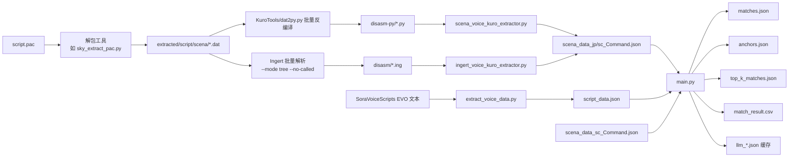
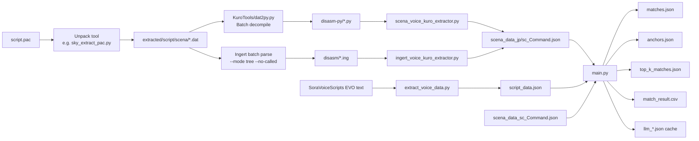

# Sky FC Script Aligner

空之轨迹1st（Remake）与空之轨迹FC进化版（EVO）台词对齐工具。

最近为了更好地应用大模型能力，对原来的 [sora-scena-matcher](https://github.com/lxr2010/sora-scena-matcher) 进行了重构。
重构后的脚本设计上也可迁移到将来的空之轨迹 2nd，甚至零/碧轨脚本比对场景。

本项目核心流程：
- 从 1st Remake 的 scena 反编译结果中提取 `Cmd_text_00/06` 等价数据（`scena_data_*_Command.json`）。
- 从 EVO 文本提取 `script_data.json`。
- 通过 `main.py` 执行多阶段匹配并输出 `match_result.csv`。

## 历史匹配统计（参考）

以下是空之轨迹 1st 的一次完整匹配结果统计（用于衡量脚本质量）：

--- 匹配统计 ---
- 剧本A总台词数: 47063
- 包含重复的匹配数: 44970
- 锚点映射数: 25678
- 唯一匹配数: 28425
- 多个匹配数: 280

## 特点

- 位置敏感哈希算法 + 基于锚点的优化 + 最小编辑距离匹配
- 保留多候选项匹配
- 匹配项 `rapidfuzz WRatio` 分数超过 92
- 复杂匹配场景通过大模型预测候选项
- 处理相同的重置版与 EVO 台词，成功匹配数达到 28425，接近人工校对水平（27537）
- 精度相比原始版本有明显提高
- 识别片假名、轨迹系列专有名词、ED6 旧引擎 Gaiji
- 无 pytorch/GPU 需求

---

## 1. 环境准备（uv）

项目使用 `uv` 管理 Python 环境和依赖。

```bash
# 1) 初始化/创建虚拟环境并安装依赖
uv sync

# 2) 运行主流程
uv run python main.py
```

### Python 版本
- `pyproject.toml` 当前要求 `>=3.13`。

---

## 2. `.env` 配置说明

复制示例文件：

```bash
copy .env.example .env
```

`.env` 至少需要：

```env
OPENAI_API_KEY=sk-xxxxx
OPENAI_BASE_URL=https://api.openai.com/v1
```

说明：
- `OPENAI_BASE_URL` 只要兼容 OpenAI API 即可（官方/第三方网关均可）。
- 代码中默认模型名写在 `llm.py`（当前为 `gpt-4o-mini`），如需替换请在该文件中调整。

---

## 3. 文件与脚本说明

### scena 源文件来源与批量反编译

- `script.pac/scena/*.dat` 是 scena 文件的原始来源。
- `script.pac` 需要先解包（可用 `kuro_dlc_tool/sky_extract_pac.py` 或其他可用工具）后，才能拿到 `.dat`。
- 以下示例假设日语 `.dat` 位于 `extracted/script/scena`。

#### 使用 KuroTools 批量反编译为 Python（输出到 `disasm-py`）

```powershell
$src = "extracted/script/scena"
$out = "disasm-py"
New-Item -ItemType Directory -Force -Path $out | Out-Null

Get-ChildItem $src -Filter *.dat -File | ForEach-Object {
    uv run python .\KuroTools\dat2py.py --decompile True --markers False $_.FullName
    $generated = Join-Path (Get-Location) ($_.BaseName + ".py")
    if (Test-Path $generated) {
        Move-Item -Force $generated (Join-Path $out ($_.BaseName + ".py"))
    }
}
```

#### 使用 Ingert 批量解析为 `.ing`（输出到 `disasm`）

```powershell
$src = "extracted/script/scena"
$out = "disasm"
New-Item -ItemType Directory -Force -Path $out | Out-Null

Get-ChildItem $src -Filter *.dat -File | ForEach-Object {
    .\ingert.exe --mode tree --no-called -o (Join-Path $out ($_.BaseName + ".ing")) $_.FullName
}
```

说明：Ingert 使用 `--no-called` 可以保留 call table 相关信息，便于后续 `add_struct` / `line_corr` 对齐。

### 主脚本
- `main.py`
  - 读取输入：
    - `scena_data_jp_Command.json`（1st 日文）
    - `script_data.json`（EVO）
    - `scena_data_sc_Command.json`（1st 简中）
  - 执行流程：
    1. `refresh_matches` 生成候选匹配 `matches.json`
    2. `optimize_with_anchors` 生成锚点 `anchors.json`
    3. `solve_gaps` 生成补全结果 `top_k_matches.json`
    4. `gen_output` 生成最终 `match_result.csv`

### 三个新增辅助脚本
- `scena_voice_kuro_extractor.py`
  - 用途：处理 **KuroTools 反编译得到的 Python 格式** scena 脚本，提取 `Cmd_text_00/06`。
  - 结果：输出 `scena_data_{jp|sc}.json` 及按类型拆分的 `*_Command.json` / `*_add_struct.json`。

- `ingert_voice_kuro_extractor.py`
  - 用途：处理 **Ingert 反编译得到的 Ingert 格式** scena 脚本，提取与上面相同结构的数据。
  - 映射关系：
    - `system[5,0] -> Cmd_text_00`
    - `system[5,6] -> Cmd_text_06`
    - calltable 对应 Python 版本中的 `add_struct`
  - 结果命名与 `scena_voice_kuro_extractor.py` 保持一致（支持 `jp/sc` 批量导出）。

- `extract_voice_data.py`
  - 用途：处理 EVO 文本脚本（`SoraVoiceScripts\cn.fc\out.msg`）并生成：
    - `script_data.json`（按 `script_id` 去重）
    - `voice_data.json`（按 `voice_id` 去重）

---

## 4. Ingert 与 KuroTools 选择说明

`ingert_voice_kuro_extractor.py` 与 `scena_voice_kuro_extractor.py` 都是为了生成同一套 `scena_data_*` 数据。

- Ingert 路线：输入是 `.ing`（Ingert 格式）
- KuroTools 路线：输入是 `.py`（Python 格式）

两种反编译结果语义一致，**二选一即可**，不需要同时使用。

### Ingert 反编译注意项
- 反编译 `.dat` 到 `.ing` 时需要带 `--no-called`，确保输出 calltable。
- 若没有 calltable，会影响 `add_struct` 侧数据与 `line_corr` 关联。

---

## 5. KuroTools 未定义 Command 的 fallback 修复

某些脚本包含未收录命令时，KuroTools 可能在命令名映射阶段报错。建议加入 fallback：

- `KuroTools/disasm/ED9InstructionsSet.py:1735`
  - 对 `commands_dict` 查找增加兜底，未知命令统一回退为：
  - `Cmd_unknown_{structID:02X}_{opCode:02X}`

- `KuroTools/disasm/ED9Assembler.py:890`
  - 对 `reverse_commands_dict` 查找增加兜底；
  - 能解析 `Cmd_unknown_XX_YY` 时直接反算回 `(XX, YY)`；
  - 否则 fallback 到 `(0xFF, 0xFF)` 并输出警告。

---

## 6. 推荐执行顺序

1. `uv sync`
2. 配置 `.env`
3. 生成 1st scena 数据（二选一）：
   - KuroTools 路线：`uv run python scena_voice_kuro_extractor.py`
   - Ingert 路线：`uv run python ingert_voice_kuro_extractor.py --jp-input <jp_ing_dir_or_file> --sc-input <sc_ing_dir_or_file> --output-dir .`
4. 生成 EVO 文本数据：`uv run python extract_voice_data.py`
5. 跑匹配主流程：`uv run python main.py`

输出核心文件：
- `match_result.csv`
- `matches.json` / `anchors.json` / `top_k_matches.json`
- `llm_*.json`（LLM缓存）

### 调用流程图（Mermaid）



---

## 空之轨迹1st 简中翻译错位清单（历史备注）

目前大模型暂时无法完全自动对齐中文翻译与日语原文。`match_result.csv` 中已知会出现如下错位项：

- `74423-74428`（次元模组台词修改）：中文翻译比日语原文多一句；需删除其中一行及对应翻译单元格并上移。
- `79491`：`抽、抽一根之后，我就会放回去的…… / 马上就会放回去…… / 工房长…………` 中间这句中文翻译为额外增加，需删除。
- `79508`：`我一直在拼命思考解决办法，不知为何，突然就非常想抽烟。 / 我一直在拼命思考解决办法…… / 唉…………` 中间这句中文翻译为额外增加，需删除。

---

## SC / 3rd 迁移说明

当前流程不依赖 1st 专属格式，迁移到 SC / 3rd 的关键是替换输入数据并做少量参数调优。

### 1) 准备输入数据
- Remake 侧（A）：沿用本仓库的提取流程，生成对应作品的 `scena_data_jp_Command.json` 与 `scena_data_sc_Command.json`。
- EVO/原版侧（B）：用 `extract_voice_data.py`（或同结构脚本）生成对应作品的 `script_data.json`。
- 要求：A/B 两侧都应保持同一作品、同一区域版本（避免混用不同补丁源）。

### 2) 文件名与路径适配
- 最简单做法：直接把 SC/3rd 生成的数据文件命名成 `main.py` 当前固定读取的三个文件名：
  - `scena_data_jp_Command.json`
  - `scena_data_sc_Command.json`
  - `script_data.json`
- 或者修改 `main.py` 中 `RemakeScript(...)` / `Script(...)` 的输入路径，分别建立 SC、3rd 的独立入口脚本（推荐）。

### 3) 迁移时建议调参
- `ScriptSearcher(threshold=0.3, window_size=3)` 可按文本风格调整：
  - 台词差异较大时，适当降低 `threshold`；
  - 长剧情块错位较明显时，适当增大 `window_size`。
- 首轮建议先保留 `top_k=3`，观察 `top_k_matches.json` 的多候选分布后再收紧。

### 4) 验证步骤
- 先看 `matches.json`：确认召回是否足够。
- 再看 `anchors.json`：确认锚点是否覆盖关键剧情段。
- 最后看 `match_result.csv`：抽查章节开头、分支段、战斗后对白等高风险区。

---

## 鸣谢

本项目开发与数据处理流程，受以下开源项目启发或直接受益，感谢各位作者：

- KuroTools  
  https://github.com/nnguyen259/KuroTools

- kuro_dlc_tool  
  https://github.com/eArmada8/kuro_dlc_tool

- Ingert  
  https://github.com/Aureole-Suite/Ingert

- SoraVoiceScripts  
  https://github.com/ZhenjianYang/SoraVoiceScripts

---

## 版权声明

- 本项目处理涉及的游戏脚本文本、语音、图像及其他资源，其著作权与相关权利归原游戏公司及权利人所有。
- 本仓库提供的代码仅用于学习、研究与非商业交流，按宽松开源方式提供。
- 严禁将本项目代码、处理结果或衍生资源用于任何商业用途（包括但不限于售卖、付费分发、商业化服务）。
- 使用者应自行确保其行为符合所在地法律法规及相关游戏/平台协议；由使用行为产生的责任由使用者自行承担。

---

## English Translation

`sky-fc-script-aligner` is a dialogue alignment toolkit for **Trails in the Sky the 1st (Remake)** and **Trails in the Sky FC Evolution (EVO)**.

This project is a refactor of [sora-scena-matcher](https://github.com/lxr2010/sora-scena-matcher), rebuilt to better leverage LLM-based matching.
The same architecture is also intended to be portable to SC / 3rd and potentially Zero/Ao workflows.

Core pipeline:
- Extract `Cmd_text_00/06`-equivalent data from the Remake scena decompilation output (`scena_data_*_Command.json`).
- Extract `script_data.json` from EVO text scripts.
- Run multi-stage alignment via `main.py` and produce `match_result.csv`.

### Historical Matching Stats (Reference)

One full run on Trails in the Sky the 1st produced:

--- Matching Stats ---
- Total lines in Script A: 47063
- Matches with duplicates: 44970
- Anchor mappings: 25678
- Unique matches: 28425
- Multi-candidate matches: 280

### Features

- Position-aware hashing + anchor-based optimization + minimum-edit-distance matching
- Preserves multi-candidate matches
- `rapidfuzz WRatio` score typically above 92 for matched items
- Uses LLM to handle hard/ambiguous matching cases
- On Remake vs EVO alignment, achieved 28425 matched lines (close to manual proofreading result: 27537)
- Significantly improved precision over the original version
- Handles katakana, Trails-specific terms, and ED6 gaiji text patterns
- No PyTorch/GPU dependency

---

### 1. Environment Setup (`uv`)

This project uses `uv` for environment and dependency management.

```bash
# 1) Create/sync virtual environment and install dependencies
uv sync

# 2) Run the main pipeline
uv run python main.py
```

Python version:
- `pyproject.toml` currently requires `>=3.13`.

---

### 2. `.env` Configuration

Copy the example file:

```bash
copy .env.example .env
```

Required fields:

```env
OPENAI_API_KEY=sk-xxxxx
OPENAI_BASE_URL=https://api.openai.com/v1
```

Notes:
- Any OpenAI-compatible endpoint works for `OPENAI_BASE_URL`.
- Default model names are configured in `llm.py` (currently `gpt-4o-mini`).

---

### 3. Files and Scripts

#### Scena source files and batch decompilation

- `script.pac/scena/*.dat` are the source files for scena scripts.
- You need to unpack `script.pac` first (e.g., `kuro_dlc_tool/sky_extract_pac.py`, or any equivalent unpacking tool) to obtain `.dat` files.
- The examples below assume JP `.dat` files are under `extracted/script/scena`.

#### Batch decompile with KuroTools to Python (output to `disasm-py`)

```powershell
$src = "extracted/script/scena"
$out = "disasm-py"
New-Item -ItemType Directory -Force -Path $out | Out-Null

Get-ChildItem $src -Filter *.dat -File | ForEach-Object {
    uv run python .\KuroTools\dat2py.py --decompile True --markers False $_.FullName
    $generated = Join-Path (Get-Location) ($_.BaseName + ".py")
    if (Test-Path $generated) {
        Move-Item -Force $generated (Join-Path $out ($_.BaseName + ".py"))
    }
}
```

#### Batch parse with Ingert to `.ing` (output to `disasm`)

```powershell
$src = "extracted/script/scena"
$out = "disasm"
New-Item -ItemType Directory -Force -Path $out | Out-Null

Get-ChildItem $src -Filter *.dat -File | ForEach-Object {
    .\ingert.exe --mode tree --no-called -o (Join-Path $out ($_.BaseName + ".ing")) $_.FullName
}
```

Note: using Ingert with `--no-called` preserves call table related information, which helps downstream `add_struct` / `line_corr` alignment.

#### Main script
- `main.py`
  - Inputs:
    - `scena_data_jp_Command.json` (1st Japanese)
    - `script_data.json` (EVO)
    - `scena_data_sc_Command.json` (1st Simplified Chinese)
  - Pipeline:
    1. `refresh_matches` -> `matches.json`
    2. `optimize_with_anchors` -> `anchors.json`
    3. `solve_gaps` -> `top_k_matches.json`
    4. `gen_output` -> `match_result.csv`

#### Three helper scripts
- `scena_voice_kuro_extractor.py`
  - Parses **KuroTools Python-format** scena output.
  - Extracts `Cmd_text_00/06` and outputs `scena_data_{jp|sc}.json`, plus `*_Command.json` / `*_add_struct.json`.

- `ingert_voice_kuro_extractor.py`
  - Parses **Ingert-format** scena output (`.ing`).
  - Mapping:
    - `system[5,0] -> Cmd_text_00`
    - `system[5,6] -> Cmd_text_06`
    - calltable corresponds to Python-side `add_struct`
  - Output naming is aligned with `scena_voice_kuro_extractor.py` (supports jp/sc batch mode).

- `extract_voice_data.py`
  - Parses EVO text scripts (`SoraVoiceScripts\cn.fc\out.msg`) and generates:
    - `script_data.json` (deduplicated by `script_id`)
    - `voice_data.json` (deduplicated by `voice_id`)

---

### 4. Ingert vs KuroTools

`ingert_voice_kuro_extractor.py` and `scena_voice_kuro_extractor.py` produce the same `scena_data_*` schema.

- Ingert route: input is `.ing` (Ingert format)
- KuroTools route: input is `.py` (Python format)

They are semantically equivalent for this workflow, so you only need one route.

Ingert note:
- Use `--no-called` when decompiling `.dat` to `.ing` so calltable is included.
- Missing calltable reduces `add_struct`-side extraction and weakens `line_corr` linking.

---

### 5. Fallback for Undefined KuroTools Commands

When scripts contain unregistered commands, KuroTools may fail during command-name resolution.
It is recommended to add fallbacks at:

- `KuroTools/disasm/ED9InstructionsSet.py:1735`
  - Add a fallback around `commands_dict` lookup:
  - `Cmd_unknown_{structID:02X}_{opCode:02X}`

- `KuroTools/disasm/ED9Assembler.py:890`
  - Add a fallback around `reverse_commands_dict` lookup.
  - If name matches `Cmd_unknown_XX_YY`, convert back to `(XX, YY)`.
  - Otherwise fallback to `(0xFF, 0xFF)` with a warning.

---

### 6. Recommended Run Order

1. `uv sync`
2. Configure `.env`
3. Generate 1st scena data (choose one route):
   - KuroTools route: `uv run python scena_voice_kuro_extractor.py`
   - Ingert route: `uv run python ingert_voice_kuro_extractor.py --jp-input <jp_ing_dir_or_file> --sc-input <sc_ing_dir_or_file> --output-dir .`
4. Generate EVO text data: `uv run python extract_voice_data.py`
5. Run alignment: `uv run python main.py`

Main outputs:
- `match_result.csv`
- `matches.json` / `anchors.json` / `top_k_matches.json`
- `llm_*.json` (LLM cache)

### Pipeline Diagram (Mermaid)



---

### Migration Notes for SC / 3rd

The pipeline is not 1st-exclusive. For SC / 3rd, replace input data and optionally tune parameters.

1) Prepare input data:
- Remake side (A): generate `scena_data_jp_Command.json` and `scena_data_sc_Command.json` for the target game.
- EVO/original side (B): generate `script_data.json` with `extract_voice_data.py` (or a structurally equivalent tool).
- Keep A/B from the same game and region baseline to avoid patch-source mixing.

2) Adapt file paths:
- Easiest: rename generated files to what `main.py` expects by default.
- Better: create separate entry scripts (SC/3rd) and change input paths in `RemakeScript(...)` / `Script(...)`.

3) Parameter tuning:
- Tune `ScriptSearcher(threshold=0.3, window_size=3)` based on script style.
- Lower `threshold` for higher variation; increase `window_size` when long blocks drift.
- Keep `top_k=3` for first pass, then tighten after checking candidate distribution.

4) Validation:
- Check `matches.json` for recall.
- Check `anchors.json` for anchor coverage.
- Spot-check `match_result.csv` on chapter starts, branching events, and post-battle dialogues.

---

### Acknowledgements

Many thanks to the authors and maintainers of these open-source projects:

- KuroTools  
  https://github.com/nnguyen259/KuroTools

- kuro_dlc_tool  
  https://github.com/eArmada8/kuro_dlc_tool

- Ingert  
  https://github.com/Aureole-Suite/Ingert

- SoraVoiceScripts  
  https://github.com/ZhenjianYang/SoraVoiceScripts

---

### Copyright Notice

- The ownership and rights of all game scripts, voices, images, and related assets processed by this project belong to the original game companies and rights holders.
- The code in this repository is provided in a permissive open-source spirit for learning, research, and non-commercial use.
- Commercial use is strictly prohibited, including but not limited to selling, paid redistribution, or commercial services based on this project, its outputs, or derivatives.
- Users are responsible for ensuring compliance with applicable laws, regulations, and game/platform agreements in their own jurisdictions.
